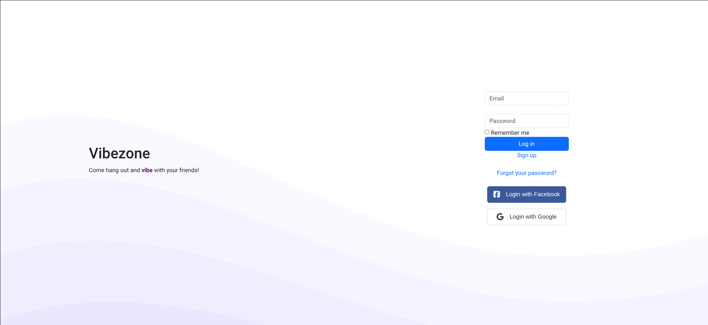
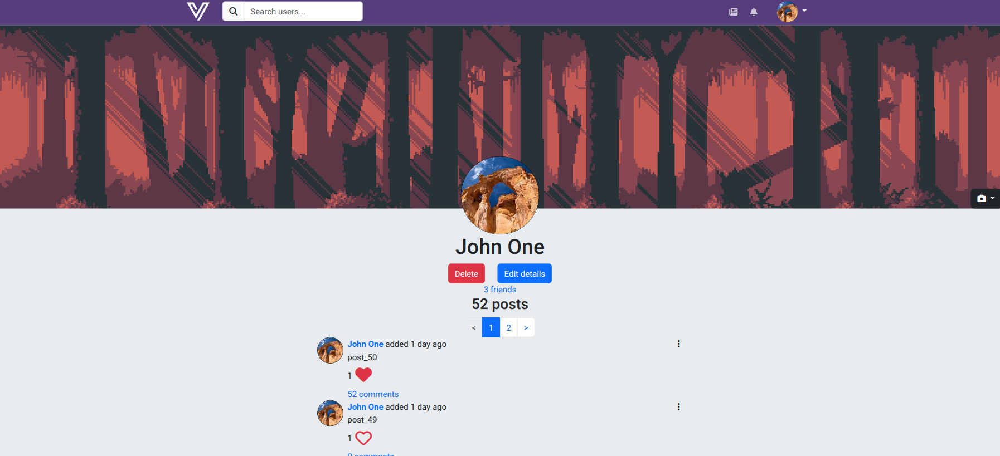
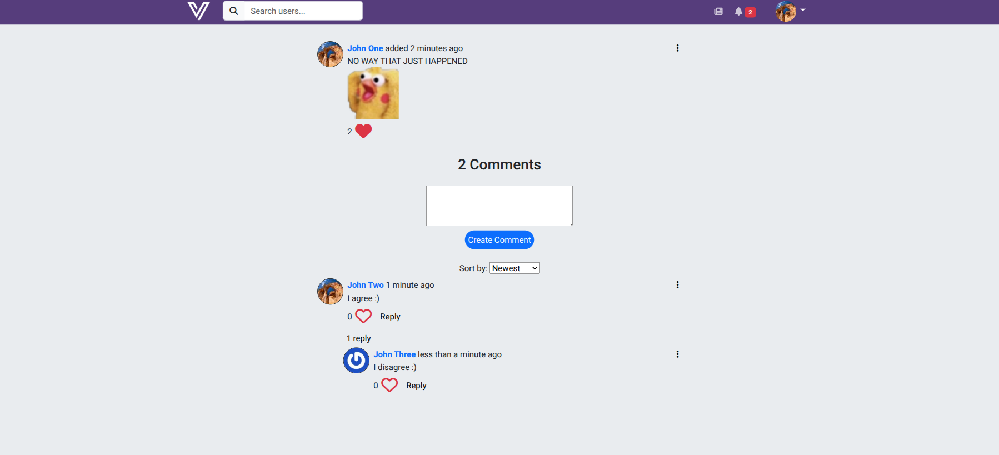
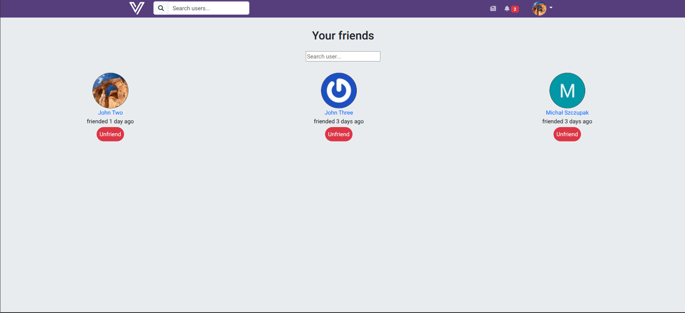

# Vibezone

A social media experience built with Ruby on Rails.

## Features

- Account creation
  - through [Devise](https://github.com/heartcombo/devise)
  - OAuth allows users to login through either Facebook or Google
- User details
  - User has an option of uploading their profile picture or use Gravatar
  - User can upload banner picture on their profile page
- Posts
  - User can write posts and attach an image to them
  - Posts can be liked and commented on
- Comments
  - Is a polymorphic association
  - User comments can be liked
  - Can be replied to
  - Can be sorted by the time of creation or by the amount of likes
  - Use pagination
- Likes
  - Use turbo frames which prevents the reloading of the whole page
- Friendships
  - Users can be friends with other users
  - After the friendship is created, users can see each other's posts on their home page
- Notifications
  - Is a polymorphic association
  - User gets notified when their post is liked or commented on
  - User gets notified when their comment is liked or replied to
  - User gets notified when they recieve a friend request or someone accepts their friend request
  - Notifications happen in real time due to turbo streams
- Jobs
  - User recieves an email when they get a friendship request or their request gets accepted
  - User recieves an email when they create their account
  - User's notifications that are older than 7 days get deleted every week through a cron job
- Tests
  - Written with Rspec

## Images

